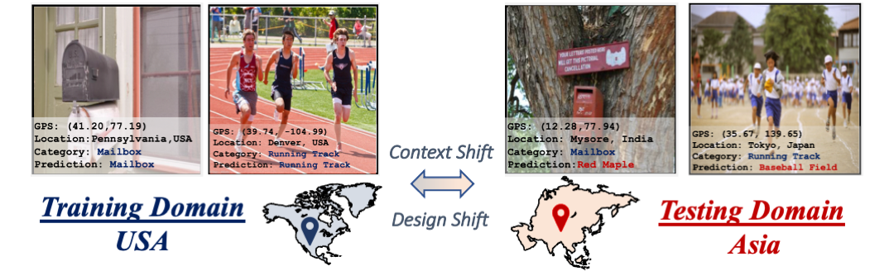

# GeoNet - CVPR 2023



[Project Page](https://tarun005.github.io/GeoNet/) | [Arxiv](http://arxiv.org/abs/2303.15443) | [Project Video](https://youtu.be/8ctgN8UBK9E) | [Challenge](https://geonet-challenge.github.io/ICCV2023/)

This repo contains the dataloader and training scripts for GeoNet dataset released as part of our GeoNet paper in [CVPR2023](https://tarun005.github.io/GeoNet/). The repository also contains baseline adaptation methods towards GeoNet challenge in [ICCV2023](https://geonet-challenge.github.io/ICCV2023/). 

### GeoNet Dataset and Statistics

|          | GeoImnet | GeoPlaces | 
| -------- | -------- | --------- | 
USA-Train      |  178110 | 154908 |
USA-Val      |  17234 | 16784     |
Asia-Train      |  187426 | 68722 | 
Asia-Val      |  26923 | 9636     |
Asia-Test |      TBD   | TBD      | 

Our GeoNet dataset is the largest yet for geographical domain adaptation, covering image classification as well as scene classification tasks. Additionally, the challenge also involves universal domain adaptation, please see the challenge [website](https://geonet-challenge.github.io/ICCV2023/challenge.html) for the details.

## Data Download.

The dataset is currently hosted on google drive, and can be downloaded using the following links.

#### Metadata JSON

The metadata contains additional information along with the images such as captions, tags and geolocations. The metadata is currently organized as a JSON file, and can be downloaded along with the images.

|           | Images | Metadata | 
| -------- | -------- | --------- | 
GeoPlaces  | [Link](https://drive.google.com/file/d/1VeMkGu2kyqRHPSe0Gg7c4qJMdSZUtteS/view?usp=drive_link) | [Link](https://drive.google.com/file/d/1LQknhiXImFt0L9fyL0lIz-lCx6Wupuxg/view?usp=sharing) |
GeoImnet   | [Link](https://drive.google.com/file/d/1XA3g9KuPjKIsVDHahm0T2Wv4_SXL19iV/view?usp=drive_link) | [Link](https://drive.google.com/file/d/13ny2WvPNlOuUBF-tHQ_YInHqd4e_fBS5/view?usp=sharing) |
GeoUniDA   | [Link](https://drive.google.com/file/d/10hoPOQN7LpLQwlTh7SPk22iGvJbYjnSK/view?usp=drive_link) | [Link](https://drive.google.com/file/d/1Zub1SUFijipfIE3USNC6LodaY9F8e-I0/view?usp=sharing)

## Training

The model training can be performed by appropriately changing the configuration file in `config/` based on the task and dataset. For example, to run USA -> Asia on GeoPlaces, run
```
python3 train.py --config configs/plain.yml --source usa --target asia --num_class 205 --data_root /data/GeoNet/ --json_dir /data/geoPlaces_metadata.json --num_iter 100000 --exp_name plain --trainer plain
```

Our codebase currently supports plain source-only training and CDAN training, we will add more methods in the future.

## Citation

If you use our dataset, please cite us using

```
@inproceedings{kalluri2023geonet,
  title={GeoNet: Benchmarking Unsupervised Adaptation across Geographies},
  author={Kalluri, Tarun and Xu, Wangdong and Chandraker, Manmohan},
  booktitle={Proceedings of the IEEE/CVF Conference on Computer Vision and Pattern Recognition},
  pages={15368--15379},
  year={2023}
}
```